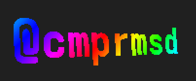

# why2025_badge_rainbow_tag
Nice Windows like wobbling screensaver showing your name tag on the WHY 2025 badge.



# Configure

1. Generate your bmp sprite with:
```bash
python create_bitmap_animation.py --text "@cmprmsd" --font /usr/share/fonts/Adwaita/AdwaitaMono-Bold.ttf --size 240x240 --bpp 8 --scroll-cycles 1
```
2. Copy the sheet.bmp to storage_skel
3. Look into the argparse arguments for further customization.
4. Edit CMakeLists.txt and add:
```js
build_app(tag_bounce
    SOURCES
     main.c
    LIBRARIES
     sdl3
)
```

# Usage

- Press `r` to rotate your tag
- Press `s` to switch between the scaling

# Helpers
You may run `show_bitmap_preview.py` for debugging as well as run the app on your computer via:
```bash
gcc main.c -o test -I /usr/local/include/SDL3 -L/usr/local/lib -lSDL3
``` 

Float scaling is quite slow, just press again to use a integer scaler.